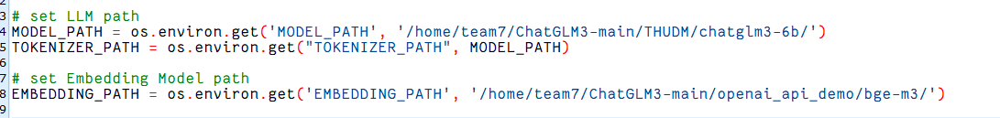
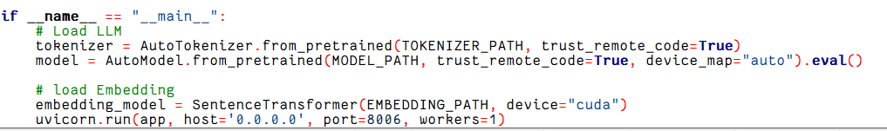

# 项目介绍：

项目来自本人参加的重庆大学软件工程2021级大三下实训。

项目参考了CHatGLM项目https://github.com/zhayujie/chatgpt-on-wechat.git

Chat on Wechat项目https://github.com/THUDM/ChatGLM3.git

# 功能介绍：

基于本地部署的ChatGLM3大模型。在本地运行api_server获得端口链接后，可以在本地和服务器端双端部署。

微信使用：可以跟bot进行文字对话、语音对话、可以生成图片、可以使用微调后的模型、还可以使用插件中的各种功能，比如文字冒险。

Web使用：也能进行对话，可以使用工具、代码解释器、能切换微调模型。

具体介绍请看介绍文档.docx

# 部署说明：

先完成ChatGLM3项目的模型部署：参考https://github.com/zhayujie/chatgpt-on-wechat.git

环境配置请参考ChatonWechat项目和ChatGLM项目。建议使用虚拟环境

部署也可参考我们的部署说明书：

下面介绍我们的几个demo：

#### openapi_server_demo

这里需要下载的模型ChatGLM3 和bge-m3。请在github上下载并配置环境。

运行api_server.py即可启动本地服务器

路径可以自己设置

#### composite_demo等

打开run_streamlit.sh  ，运行里面的命令。即可启动服务器，这是Web端服务器

剩余几个demo：composite_demo_1、composite_demo_2、composite_demo_no 

也是作为服务器端操作：cd到相应demo，打开其中的run_streamlit.sh。复制命令语句，在命令行输入即可启动服务器。

#### 上述几个demo推荐在liunx服务器上运行

#### 前端代码chat_on_wechat_perfect，和frontuser文档。

运行chat_on_wechat_perfect的app.py。

会弹出一个二维码，扫描二维码之后你的变成微信即可变成智能答疑机器人。

运行app_1.py，会生成一个网页，这是管理员界面。可以修改模型功能和微调模型。也可以生成二维码，功能如上。

#### 数据库配置

建表语句和初始化脚本放在项目中，请按照上面配置

#### 前端代码和数据库建议部署在本地

#### 看看生成的可爱猫猫：

